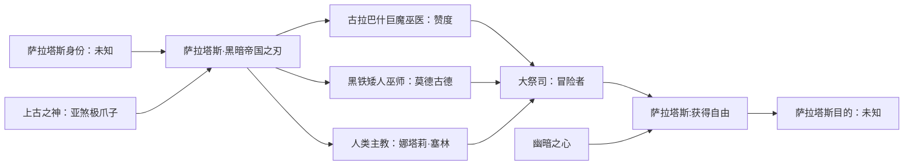

**萨拉塔斯，黑暗帝国之刃**（Xal'atath, Blade of the Black Empire）是魔兽世界：军团再临中加入的牧师神器之一，它是一件主手匕首，其在游戏中的配套副手物品为虚空的秘密。

---
## 简介
这把摄人心魄的匕首由太古时期以上古之神的爪子所制成。黑暗祭司在黑暗帝国鼎盛时期用它来执行献祭仪式。

上古之神陨落后，教徒们把萨拉塔斯藏了起来。在漫长的历史中，这把匕首每次出现，都有恐怖仪式或灾难接踵而至。这把匕首拥有自己的意志，能用强大的虚空能量和精神魔法扭曲周围的一切，达到其恶毒无比的目的。


## 神器故事
萨拉塔斯，黑暗帝国之刃蕴含着一股可怕的古老力量，正在蠢蠢欲动。虽然这把匕首可以作为暗影魔法使用者的强大武器，但是一定要谨慎使用。

萨拉塔斯有自己的思想。不要理会它疯狂的耳语，不要相信它的谎言。让它为你所用，但别忘了，这把利刃中的黑暗存在，并不是你的盟友。




### 第一章
萨拉塔斯的起源极其黑暗。在那远远早于部落与联盟的时代，传说中的上古之神及其黑暗帝国让世界笼罩在暗影之下。

关于这把利刃的起源众说纷纭。有一种比较离奇的说法称，这把匕首是一个被遗忘的古神的残骸，它在黑暗帝国初期就被自己的同胞吞噬了。也有其他的一些说法，比如萨拉塔斯是亚煞极之爪，从这个上古之神的巨大身躯上剥离下来，赐给其仆从，用作仪式献祭之用。

虽然这些故事都很不可思议，但是也许当中揭示了一部分的真相。萨拉塔斯脉动着上古之神的污秽精华。甚至有人说，这把利刃能让其拥有者看到黑暗帝国的幻象，但是所有看到此等惊惧景象的人都已经陷入了疯狂。

### 第二章
泰坦创造的强大生物最终击溃了黑暗帝国。他们把上古之神和它们的爪牙囚禁在了地下的监狱里。和谐降临到了艾泽拉斯，但是却并没有维持太久。

这跟萨拉塔斯脱不了关系。

这把利刃依然存在于世，在凡人手中几经易手，而留下的只有死亡和混乱。其中一个不幸拿起萨拉塔斯的人，是一个叫做赞度的巨魔。这个野心勃勃的巫医来自强大的古拉巴什部族。他的对手将他从权力与名望的高位上驱逐了下来，于是赞度整日都在酝酿着复仇之梦。

对萨拉塔斯来说，借着赞度的愤怒来把他扭曲为自己的棋子实在是轻而易举。

### 第三章
在萨拉塔斯的低语引导下，赞度和一群忠实的巫医出发寻找一个奇异的黑石堆。巨魔秘法师早已禁止族人前去打扰那里的安宁，但是赞度对这个禁忌视而不见。他相信，这个石堆蕴含着巨大的力量——他可以使用这力量来打败他的对手。

他和他的追随者很快就会发现，石堆其实是一个沉眠的上古之神仆从，基希克斯的身躯。

萨拉塔斯催促赞度为怪物进行血祭。巫医的心灵已经被利刃腐化，于是他毫不犹豫地用萨拉塔斯肢解了几个同伴，并用他们的鲜血和尸骸作为唤醒巨兽的祭品。仪式的最后，赞度将这把沾满鲜血的匕首插进了基希克斯的外皮里……这个巨大的怪物随之轰然苏醒。

再也没有人看到过赞度和他的追随者。巨魔后来探查了这个地方，只发现了四散的骸骨，上面的肉被剔得一干二净。

### 第四章
基希克斯苏醒后，艾泽拉斯立刻蒙上了战争的阴影。这个巨大的怪物集结了其他上古之神的仆从，发动了一场战役，想彻底粉碎巨魔文明。

与唤醒他的巨魔不同，基希克斯知道如何驾驭萨拉塔斯的真正潜能。这个克拉西斯召唤了利刃的力量，在巨魔中散播瘟疫，削弱了他们的肉体，然后用死亡的幻象狂轰乱炸，削弱他们的心灵。

虽然巨魔们最终消灭了基希克斯，打败了他的军队，萨拉塔斯依旧在战争幸存者的梦境中纠缠不休，直到他们全都死去。很多部族都流传着有一把黑暗之刃几乎让他们灭绝的传说。

### 第五章
>摘自《莫德古德之死》第四章，关于黑铁巫师获得萨拉塔斯时的记述：
>
>>莫德古德继承了氏族研究奥术魔法的悠久传统。身为巫王索瑞森的妻子，她坐拥黑铁氏族最强大的魔法神器。但是她对自己手上这些敬献之物还不满足。莫德古德经常派遣她的仆从去寻找新的圣物来供她研究，并作为创造法术的法器。
>>
>>有个矮人带回了一把充盈着黑暗能量的利刃。莫德古德立即被吸引了。她花了几天的时间研读文献，想要探索这把匕首的奥秘。有时候，人们看到她对着这把武器说话。莫德古德后来现身，想见见带回这把利刃的矮人，并向他致谢。
>>
>>谁都找不到他。谁都记不起他的名字和他的脸庞。他好像凭空消失了一般。

### 第六章
>摘自《莫德古德之死》第二十三章，关于黑铁部族与蛮锤部族在格瑞姆巴托的战斗的记述：
>
>>作战魔像打破了格瑞姆巴托的大门，黑铁士兵涌入蛮锤部族的首都。两支部族充满了仇恨，双方都毫不留情。
>>
>>蛮锤部族的英勇是他们最强大的武器，莫德古德想夺走他们的英勇。战锤与利斧交错发出了震天巨响，而她高声念着咒语，施放着亵渎的法术。她用她的魔法匕首在手掌上划开了口子，让她的鲜血滴溅到石头上。
>>
>>莫德古德的秽邪仪式为格瑞姆巴托的暗影赋予了生命。它们从城市的黑暗角落中浮现，手持用黑夜铸就的利刃，降临到蛮锤矮人身上。

### 第七章
>摘自《莫德古德之死》第二十七章，关于黑铁矮人入侵格瑞姆巴托的最终时刻的记述：
>
>>亲王卡德罗斯用非凡的勇气聚集了剩下的蛮锤部族战士，对黑铁矮人发动了孤注一掷的反攻。卡德罗斯凭借着作战魔像般的专注意志，像蛮牛一样冲锋陷阵，停在了莫德古德面前。
>>
>>蛮锤部族和黑铁部族的命运会在此处决定。
>>
>>女巫向卡德罗斯释放了黑暗的力量，但是他的攻击没有停歇。然后，莫德古德伸手去拿她的黑暗之刃——那把让格瑞姆巴托变成梦魇之城的武器。它却不见了。
>>
>>她失去了宝贵的武器。或者，按某些人的说法，这把武器抛弃了她。
>>
>>卡德罗斯猛力挥动战锤，对莫德古德造成了致命的打击，为蛮锤部族争取到胜利。据说，女巫躺在地上，濒死之时，口中不断重复着一句话：“你答应过……”

### 第八章
莫德古德失去萨拉塔斯后，过了几十年，这把利刃被一个人类主教获得，她名叫娜塔莉·塞林。她经历了第一次大战，见证了兽人部落入侵艾泽拉斯并征服了暴风城。

战后，塞林意识到，要打败这些绿皮兽人，人类需要研究他们所使用的奇特力量。她认真调查了他们的魔法，前往受到他们黑暗魔法污染的战场深入探究。

在调查中，她得知兽人曾经在他们的血腥仪式中使用过一把异界利刃，这把利刃可以操纵暗影本身。塞林对这样一把亵渎的武器的存在十分担忧，她发誓要追查它的下落，并以圣光的名义将它摧毁。

### 第九章
>摘自由娜塔莉·塞林撰写的《虚空的秘密》：
>
>>我接触到利刃的一瞬间，脑海中听到了一个名字：萨拉塔斯。我当时就知道，我无法摧毁这把匕首，至少当时还不行。一个人怎么可能打败她不理解的力量呢？
>>
>>我还需要了解很多东西，很多很多。无论我清醒时，还是睡梦中，萨拉塔斯都会对我低语。它教给我，这个世界除了圣光，还有很多别的东西，还有虚空。
>>
>>在这两种力量的涨落之间，你能找到强大的力量和深奥的知识，远超圣光大教堂[备注 1]所传授的东西；你能跨越圣光和虚空之间的界限；你能以光明与黑暗的力量，成就伟大的未来。
>>
>>当然这样做是有代价的。在暗影中行走总会有代价的。

### 第十章
到了第二次大战，娜塔莉·塞林已经从萨拉塔斯学会了如何使用暗影魔法。她把危险的技巧传授给了其他的圣光信徒，并号召他们一起对抗部落。塞林和她的追随者在暗影中战斗，在人类王国中四处猎杀兽人。

萨拉塔斯继续在塞林的心中低语，逐渐销蚀了她的理智。虽然她的意图高尚，但是她对这把利刃和虚空的奥秘变得越来越痴迷。

塞林的同伴也一样。他们对这场抵抗兽人的战争变得过于狂热，使得无辜的生命承受风险。有些人在暗影中陷得太深，完全抛弃了圣光。虽然塞林提醒她的追随者谨慎使用这种力量，但却被当成耳边风被无视，甚至还遭到质疑。

虽然不清楚这位前任主教到底发生了什么，但有一些消息指出萨拉塔斯让她的盟友背叛了她。它让他们相信，塞林阻扰了他们掌握自己的真正潜能——阻扰了他们获得知识和力量，而且只要杀死她，他们就能获得这些知识和力量。

夜深人静之时，他们谋杀了塞林，并将萨拉塔斯据为己有。

### 第十一章
多年来，肯瑞托的法师监视着娜塔莉·塞林，她的黑暗教义让他们倍感困扰。她死后，他们着手将她撰写的文献从历史中抹去。法师们造访她去过的村庄和城市，收集她写下的每一份卷轴和典籍。

肯瑞托把这些文献藏在达拉然，希望塞林的危险魔法学派就此终结。但是虽然他们付出了努力，还是不能抹去她所传授的关于光明与暗影的教义。在后来的岁月里，还有人接受她的教义，将自己投入到圣光与虚空当中。

法师们也知道萨拉塔斯的存在，但却无法找到它。但就跟塞林的教义一样，这把利刃不会轻易消失。

它还打算扭曲更多的心智，操纵更多的傀儡，让更多的无辜的人陷入恐惧之中。

```markdown
萨拉塔斯，黑暗帝国之刃说： 软弱的可怜虫！暮光教父不敢用我，是因为他明白失败的代价。
萨拉塔斯，黑暗帝国之刃说： 而你就不同了，我们可以干出一番大事业。拿起我吧，我会暂时……帮助你的。
萨拉塔斯，黑暗帝国之刃说： 对，我们急于享用那堕落泰坦的爪牙。但首先是……扎卡兹。
萨拉塔斯，黑暗帝国之刃说： 那群邪教徒可能会再度唤醒他，他也可能自行苏醒。我们得吞噬他的力量，让他彻底完蛋。你知道这是有必要的。
萨拉塔斯悄悄地说：上古之神的仆人，让我们吞掉他。
萨拉塔斯悄悄地说：看！恩佐斯的密探，我们该杀了他。
萨拉塔斯悄悄地说：看见了吗？那个可怜的宿主已经没救了，只能杀掉。
萨拉塔斯悄悄地说：那个家伙背叛了他的世界和同胞，他迟早要死……只看是谁杀了他而已。
萨拉塔斯悄悄地说：又是萨格拉斯的匿名暴徒，假装来帮助这些精灵。他们还蒙在鼓里。
萨拉塔斯悄悄地说：灾难笼罩着这里。精灵废墟里充斥着有待收割的躁动灵魂。
萨拉塔斯悄悄地说：这里的巨龙很弱，你该好好利用这一点。
萨拉塔斯悄悄地说：军团在这里挖地三尺。如果他们再挖下去，恐怕就要遭殃了。
萨拉塔斯悄悄地说：这个灵魂充满愤怒！它会是个很好的目标。
萨拉塔斯悄悄地说：又一个痛苦的灵魂，早该彻底湮灭了。但我对他的顾问更感兴趣……
萨拉塔斯悄悄地说：对萨格拉斯而言，招募艾瑞达绝对是神来之笔。他的军团急需提高智商。
萨拉塔斯悄悄地说：一具腐化的巨龙尸体……这能有多危险呢？
萨拉塔斯悄悄地说：又是萨维斯扭曲的走狗，德鲁伊真该好好控制自己的心智，你不觉得吗？
萨拉塔斯悄悄地说：萨维斯很狡猾。既然可以远程遥控，又何必赤膊上阵呢？
萨拉塔斯悄悄地说：他这副模样可能是恩佐斯造成的，可这种傲慢，完全是他自己的产物。
萨拉塔斯悄悄地说：见证这些以泰坦的名义白白浪费掉的泰坦之力吧，仅此而已。
萨拉塔斯悄悄地说：奥丁是个了不起的敌人，直到他的傲慢毁了他自己。你该问问他对洛肯临死前说的那段话有什么想法吗。去！[备注 2]
萨拉塔斯悄悄地说：斯科瓦尔德想要加入毁灭者的行列，却没想到敢这么干的人最后都众叛亲离了。
萨拉塔斯悄悄地说：那条陨落的守护巨龙的巢穴就在附近，他是最强大，但也最容易被腐蚀的守护巨龙。
萨拉塔斯悄悄地说：这里繁衍着许多失败的泰坦试验品。卓格巴尔完全证明了自己是种失败的造物。
萨拉塔斯悄悄地说：考虑到他们的起源，这里的牛头人对于腐蚀的抵抗力相当高。
萨拉塔斯悄悄地说：希望我们的主人能真正进入这个国度。你看到的只是一些碎片，阴影；最微弱的回响。你可以去问问虚灵，这些存在有多大的威能。
萨拉塔斯悄悄地说：靠近虚空的感觉很舒服。我曾在一个类似的地方献祭了大量生物。每一次死亡都能让我们离彻底腐蚀这个世界更进一步。
萨拉塔斯悄悄地说：我还记得那个天真的黑铁矮人。莫德古德很容易受影响，她太愤怒了。你知道我在最危急的关头背弃她，倒向蛮锤部族时，她有多么愤怒吗？我是很容易遗失的。记住这一点。
萨拉塔斯悄悄地说：这次，我们可能会面对我的同胞……真让人开心。他们的力量将属于我！他们将为过去对我所做的一切付出代价。
萨拉塔斯悄悄地说：被囚禁的深渊之神愤怒地翻腾着，慢慢侵蚀着身上的枷锁。你得快点打败那个堕落泰坦……还有更可怕的战斗在等着你呢。
萨拉塔斯悄悄地说：真讽刺，最弱的那个居然成了最后的胜利者。克苏恩，尤格-萨隆，亚煞极，还有……好吧。只有一个人能吞噬这世界，这是注定的。
萨拉塔斯悄悄地说：如此美味。
萨拉塔斯悄悄地说：聚沙成塔。
萨拉塔斯悄悄地说：感觉如何？
萨拉塔斯悄悄地说：真无聊。
萨拉塔斯悄悄地说：你感觉到它的消逝了吗？
萨拉塔斯悄悄地说：<短促的笑声>
萨拉塔斯悄悄地说：据说他的同类都无法腐化。我想这对我的兄弟们是个教训。
萨拉塔斯悄悄地说：洛肯成功地挑唆了她。但事实上，奥丁的傲慢才是主因。
萨拉塔斯悄悄地说：伊米隆是个好棋子。在散播血肉祝福时，他比其他同胞做得更好。
萨拉塔斯悄悄地说：一头岩石野兽，胡乱挥霍着他难以控制的力量。应该在他破坏我们的计划之前干掉他。
萨拉塔斯悄悄地说：他不是我们的仆人，但他听到了我们的低语。这彻底腐蚀了他。
萨拉塔斯悄悄地说：这里的位面屏障很薄弱，很容易撕裂。你知道真正的暗影和圣光在这里相遇会发生什么事吗？
萨拉塔斯悄悄地说：这里对虚空的研究值得赞赏，但这是徒劳的。你们怎么可能明白连泰坦都理解不了的东西呢？
萨拉塔斯悄悄地说：我知道纳鲁认为我们是要抵制的恐怖怪物。但我们不这么认为。他们只是迷途的同胞而已。总有一天……他们将回到主人身边。
萨拉塔斯悄悄地说：噢！你召集了不少追随者。幸好他们都在关注这次入侵，而不是真正的战争。这场战争的规模足够让你想破脑袋。
萨拉塔斯悄悄地说：纳鲁提过永恒战争吗？相比漫长的岁月，你们这世界的历史不过是沧海一粟。它们说过德莱尼诞生前的历史吗？没有？<短促的轻笑声>
萨拉塔斯悄悄地说：萨维斯充分发挥了新主子的力量。蒙蔽半神的头脑可不简单。
萨拉塔斯悄悄地说：腐蚀翡翠梦境的守护者是一个大胆的举动。但萨维斯可能有些冒进了。他应该默默地扩散梦魇的影响力，而不是打草惊蛇。
萨拉塔斯悄悄地说：又一颗根植于死亡的腐蚀之种。暴躁的幽灵将在愤怒中徘徊，在痛苦中成长。一个深渊之神的猎物。
萨拉塔斯，黑暗帝国之刃说： 几乎彻底消失了，就像从未出现过。但这条裂隙很深很大，下面的某个地方仍在翻腾。有些东西变了，最后的禁锢松动了。我们得做好准备。[备注 3]
萨拉塔斯悄悄地说：看来恩佐斯的牢笼不如过去坚固了。你看到的只是一头足以吞噬世界的巨兽的渺小衍生物罢了。
萨拉塔斯悄悄地说：巨龙服从萨维斯，而萨维斯是深渊之神的仆从。她不再喷出生命的精华，而是吞噬周围的一切。
萨拉塔斯悄悄地说：泰坦的守卫者又少了一个。每一次死亡都让它雪上加霜。他的痛苦或许结束了，但我表示怀疑。
萨拉塔斯悄悄地说：萨维斯总是不断改换门庭以攫取力量，却一次又一次被击败。深渊之神选错了勇士？他还有别的底牌吗？
萨拉塔斯悄悄地说：强大的巨龙能成为强大的工具。迦拉克隆的时代结束了。
萨拉塔斯悄悄地说：这三个家伙已经享受恩佐斯的秘密眷顾太久了。可惜他们横行霸道的日子结束了。
萨拉塔斯悄悄地说：哪怕是长寿的精灵，她也太傲慢了。她的生命之力非常美味。
萨拉塔斯悄悄地说：她宣称能预知未来。可那些比她活得更久的人才知道真相。她为了保住权位，毁了她的人民。
萨拉塔斯悄悄地说：这个家伙只窥探到可怕真相的冰山一角，就被彻底蒙蔽了。
萨拉塔斯悄悄地说：这家伙早就该死了。他是堕落泰坦真正的仆从，想要毁灭一切。好像这真能让他们免遭虚空吞噬似的。
萨拉塔斯悄悄地说：一个邪能种族的有趣杂交品。我在想，这种东西还有多少？
萨拉塔斯悄悄地说：一个古老物种的有趣变体。它的甲壳几乎牢不可破。“几乎”……
萨拉塔斯悄悄地说：<短促的笑声>
萨拉塔斯悄悄地说：这里全是泰坦的子嗣。尽管接受了血肉“恩赐”，他们仍在崇拜那些伪神。
萨拉塔斯悄悄地说：海拉和她的教派在这里很强大。现在，她已经很接近真理了。
萨拉塔斯悄悄地说：不要被那些高大的泰坦雕像唬住了。和尼奥罗萨的献祭之塔相比，这些破神殿不过是小矮人。
萨拉塔斯悄悄地说：比起长眠之城，这座精灵城市黯然失色……
萨拉塔斯悄悄地说：苏拉玛，它的“贵族”正在贪婪地吸吮这世界的生命之血。
萨拉塔斯悄悄地说：这些精灵蜷缩在他们的高墙后死去。他们看不到其他出路……
萨拉塔斯悄悄地说：看到尤格-萨隆的梦魇遍地开花，我很嫉妒……又有些骄傲。
萨拉塔斯悄悄地说：在这里，你会明白军团的入侵为什么是徒劳的。一切都会被腐蚀，梦境和恶魔都一样。
萨拉塔斯悄悄地说：精灵们绝望地想要摆脱梦魇，而恶魔想要掌控它的力量。他们都将失败。
萨拉塔斯悄悄地说：你觉得她是从何时开始蜕变的？几百年前？她以牺牲和正义之名掩盖了对力量的渴望。
萨拉塔斯悄悄地说：这家伙很古老，但还不是最早的那批，这些生物过于渴望魔法，所以不愿臣服，但他们偶尔还是很有用的。
萨拉塔斯悄悄地说：又一个蠢货，居然相信了伊利丹关于牺牲和正义的谎言。他给所有人带来了痛苦。
萨拉塔斯悄悄地说：她的母亲更令人印象深刻。这小丫头控制不住自己的饥渴，而且过分依赖战术。很容易对付。
萨拉塔斯悄悄地说：真的？萨格拉斯的这些暴徒太没个性了。这家伙很擅长用斧子！真特别。
萨拉塔斯悄悄地说：法力风暴家族怎么堕落成这样了！破机器和小戏法对他们毫无帮助。但他们还算有用。
萨拉塔斯悄悄地说：恩佐斯的这个白痴脓包活得太久了……他也没办法扭转我对这世界新主人的看法。
萨拉塔斯悄悄地说：想想吧。一个军团恶棍毁灭了无价的知识。
萨拉塔斯悄悄地说：这家伙在这个世界肆虐已久。他的阴谋并未全部得逞，但得逞的那些都后患无穷。
萨拉塔斯悄悄地说：从诞生的那一刻起，深渊领主就笨重而且愚蠢。军团还放大了这些特点。
萨拉塔斯悄悄地说：有时，娜迦会向军团乞讨一些残羹冷炙。但他们的女王还想要更多。
萨拉塔斯悄悄地说：啊，我就喜欢看到仇敌的祭坛被他们自己的崇拜者的灵魂玷污。
萨拉塔斯悄悄地说：傲慢的古代精灵那么珍惜自己的灵魂。多么绝妙的讽刺。
萨拉塔斯悄悄地说：入侵者胡乱腐蚀了其他入侵者。真老套。把他们骗上合适的道路会更有用。你说呢？
萨拉塔斯悄悄地说：让我指导你和这家伙战斗吧。虽然他只保留了一丝堕落泰坦的力量，但没有我的经验，你也毫无机会。
萨拉塔斯悄悄地说：只有在欺诈者自己的地盘上才能击倒他。来吧，我们尝尝他的灵魂。
萨拉塔斯悄悄地说：这座破败的神殿里存在着一些力量，它是我们的！来吧，进入法阵夺取它。
萨拉塔斯悄悄地说：我的错，看来那个傲慢的“女神”还盯着这里。噢，好吧……[备注 4]
萨拉塔斯悄悄地说：这么多死亡，这么多力量。
萨拉塔斯悄悄地说：这不就是被你们凡人引以为耻的地方吗？但愿你们这次表现得好些。
萨拉塔斯悄悄地说：我不信这片土地见识过堪比克坦斯之战的大屠杀。那是很久以前的事了……
萨拉塔斯悄悄地说：这里总是充满了力量。艾格文被吸引至此，之前是精灵，再之前是巨魔。而巨魔之前……
萨拉塔斯悄悄地说：相比曾矗立于此的庞然大物，那高耸入云的邪能高塔不算什么。
萨拉塔斯悄悄地说：几个世纪前，深渊之神在此惨败于七头之神。但通常，失败最终都会转化为恩佐斯的优势。
萨拉塔斯悄悄地说：这点微不足道的小冲突只能算小打小闹。当轮回结束，真正的大战才会降临。
萨拉塔斯悄悄地说：这场冲突只是上古战争的余波，那时还没有多管闲事的泰坦。无穷大军在无尽的战斗中碰撞。但你们的小战争……也有点看头。
萨拉塔斯悄悄地说：大分裂之后，我花了几个世纪才回到地表。娜迦太痴迷于神器了。
萨拉塔斯悄悄地说：这片土地变化真大！大灾变，大分裂，大清洗。你们根本不明白。
萨拉塔斯悄悄地说：选择了你真好。其他使用者可不会像你那样大杀四方。我很欣赏你的耐力。
萨拉塔斯悄悄地说：圣光只会把你们剩下的人变成迟钝的顺民。而我能提供自由和力量。希望你能记住我的慷慨。
萨拉塔斯悄悄地说：你的盟友说我居心叵测。但我只是让你沿着选定的道路快步前进罢了。
萨拉塔斯悄悄地说：我感觉这世界的心跳正在加速。它的生命之血即将喷薄而出。
萨拉塔斯悄悄地说：废了这么多工夫和口水，就为了拖延强者取得注定的胜利。
萨拉塔斯悄悄地说：想想吧，要是这台机器充满我们的力量。有趣……
萨拉塔斯悄悄地说：真可惜。他站错了队，浪费了自己的潜力。
萨拉塔斯悄悄地说：这些冒牌货在呢喃着疯狂的低语。真外行！让我来示范一下正确的技术。
萨拉塔斯悄悄地说：这家伙一定能成为我们的杰出勇士，他或许还可以被转化？
萨拉塔斯悄悄地说：我们一直在想办法进入此地！想不到是一介凡人帮我们站稳了脚跟。我们会记住你的贡献的！
萨拉塔斯悄悄地说：她很有潜力。低语声会引诱她走向宿命。
萨拉塔斯悄悄地说：她已经破茧化蝶，成为我们中的一员了。
萨拉塔斯悄悄地说：他在夸耀对暗影的蔑视。傲慢会毁了他的。
萨拉塔斯悄悄地说：看着软弱的心灵沉沦黑暗吧。
萨拉塔斯悄悄地说：虽然我渴望力量，但这家伙对它的摸索还很业余。
萨拉塔斯悄悄地说：这才是真正的美！你们这些凡人中总算有一个能欣赏它的人了。
萨拉塔斯悄悄地说：你闻到了吗？疯狂的甜美香气？唔……这地方已经被它吞噬了。
萨拉塔斯悄悄地说：这里充满潜力，可都浪费在了无谓的远征上。
```

8.1PTR数据挖掘
前瞻剧透
收录于版本8.1PTR数据挖掘
这可真是反常。 哦？黑暗帝国之刃？没错，最近我发现了它。 好吧，我倾向于让你拿走它……我认为它没准是这一切的罪魁祸首。又或者是它亲口这么说的。我是否注意到它在说话呢？ 可以让我拿着萨拉塔斯吗？这很重要。


Tanatoa指着他矮小的朋友，做了个粗鲁的手势。 Tanatoa生气地发出咔哒声，在萨拉塔斯上下了一个黑暗魔法。 Toatana生气地发出咔哒声。 Toatana打着手势，发出奇怪的呼噜声。 Toatana摇了摇头，敲了几下萨拉塔斯。

我现在有点忙！ 匕首在哪里，萨拉塔斯？ 我把它锁在那箱子里了。它一直在和我说话。


我们发现了萨拉塔斯，并决定唤醒它。 萨拉塔斯……一把迷人的武器。我曾听说过它的事迹。 遗憾的是它现在陷入了休眠。但只要是沉睡的东西，都可以唤醒。 这把利刃不仅仅是一把匕首。它是照亮我们前行道路的火炬。


在遗忘边缘找到我。在那里，我们将用这些遗物，力挽狂澜于恩佐斯及其仆从的手中。 待了如此之久... 我能感觉到他的怒火...他的饥渴... 黑暗帝国必将再度崛起！ 是的，这样一来元素便集结于此... 还有一些其他的东西... 我会带走这些东西。是时候让黑暗重现于世了。 法苏尔(Fat'huul)，解决他们。 你可以留着你那份祭品。这也许可以逗乐他。 当我们离开时，我们之间的契约便终结了。如果你胆敢在我们的神面前背叛我们，你破碎灵魂的哀号便将永世回荡于此。


听从我的呼唤，恩佐斯！我为你带来了礼物！ 作为交换，打破最后的封印，释放我！ 如你所愿。 你做了明智的选择，凡人。 通过与我同行，你为自己创造了千载难逢的良机。 你的名字会响彻黑暗帝国。 不久……我们会再次交谈的。


在我的脚下，这个世界在痛苦地翻滚。在我的舌尖上，我能品尝到你的恐惧。 你为我带来了这些。剑刃解开了我们的封印，但你的盲从为我提供了力量。


为你的蔑视付出代价！ 在你真正的主人面前跪下！ 血肉真是脆弱！ 毫无价值！ 你的梦结束了！ 他们经过考验……毫无价值。 他们不是你要找的人，大人。我们会找到其他人来开启道路。 大人……他们是……有价值的…… 一切……都将……苏醒……


鲜血之潮涌起！ 我就是。


他的双眼注视着每一个真相……每一个不可计数的罪行！ 他的奉献超越了砂砾……超越了群星！ 他的凝视落在每一步上……每一个梦境都有其形态！ 感受他真实的力量！ 荣耀你的主人！ 他的荣耀苏醒了！ 伟大的恩佐斯，请帮助您忠诚的仆人！ 啊……你认为你理解这股力量。 风暴拥有着力量……但需要付出代价。 让你的愤怒……变成一把充满仇恨的武器。 孩子们……深渊为我统治。 更深，无尽的深处…… 让潮水将你带进我的梦境…… 终于……拥抱暗影的真相吧。 是的……你靠近了……更加接近了。 随着每一个作出的决定，你离成为我的仆从又近了一步。 不过是些小玩意，在神的注视下腐烂吧。 枯萎！ 跪下！ 服从！ 是的……你确实是我要找的那个人。那个扭转了潮汐之人。 接受现在的伟大赐福吧。你的梦境将和我的融为一体。星辰的循环将创造新的肉体。 她会向你展示这条道路。来吧……来吧。当时候到来，所有眼睛都将睁开。


宇宙在我面前展开。你或许会祈祷我们的道路再也不会交汇。 然而，对你来说，我有一件你永远不会问的事情……这是你应得的礼物，我的勇士。 要知道你帮助阻止了那些微不足道的入侵——而因此，我们打开了一道通往比纳沙塔尔还要广阔的地方的大门。


力量正在消失……我需要……鲜血……灵魂…… 我知道这可能是……和一把武器交谈时的不适感。放轻松。我只想帮你充分发挥你的潜能。 为什么？因为最近我帮助了另一个凡人，我们击败了燃烧军团拯救了艾泽拉斯。这就是为何在召唤你时，我变得如此虚弱。那个牧师真是目光短浅。 而你……我感觉到你注定是会成为伟人的。我们将联手完成伟大的事业，我和你。伟大的事业。 是的。是的。已经太久了。这具躯体如此的……美味。 我知道你的选择是对的。如此杰出的……英雄。 我们组成了一支伟大的团队。 那些被我们触碰过的人的鲜血……比别的都要甜美。 帮帮……我…… 靠近我。我不想失去你。 我一直很欣赏你，我的……勇士。


重获新生是多么荣耀啊。我没有忘记你在希利苏斯如何无情地使用我。 我很……高兴——我们又可以在一起了。你一直都是我的最爱。


这句话疑似是麦格尼说的： 另一个上古之神苏醒了……这不是个好兆头。我们的世界已经承受够多了。希利苏斯的伤口，这场战争……

[备注 5]

8.15语录
```markdown
萨拉塔斯悄悄地说：壮美之物在等待着我们。
萨拉塔斯悄悄地说：向低语敞开心扉吧。
萨拉塔斯悄悄地说：时候……马上就到了。
萨拉塔斯悄悄地说：你在寻找什么？
萨拉塔斯悄悄地说：如此多的可能性。
萨拉塔斯悄悄地说：有话就说吧。
萨拉塔斯，黑暗帝国之刃说： 娜迦想借助圣物的力量来进行仪式。他们想召唤风暴，清洗这个世界上所有异教徒。真是群疯子。
萨拉塔斯，黑暗帝国之刃说： 力量在消散……需要……鲜血……灵魂……
萨拉塔斯，黑暗帝国之刃说： 重获新生的感觉真棒！但我并没有忘记你在希利苏斯是怎么蹂躏我的。浪费了大好的潜力。
萨拉塔斯，黑暗帝国之刃说： 我们又有机会在一起了，我好高兴。我有过许多的伙伴，但我最中意的依然是你。
萨拉塔斯，黑暗帝国之刃说： 只要你我携手，就一定能达成非凡的成就。举世瞩目的成就。
萨拉塔斯，黑暗帝国之刃说： 我也知道跟武器谈心难免令人惶惶不安。不过别紧张，我只是想帮你挖掘自己的潜力。
萨拉塔斯，黑暗帝国之刃说： 唉……我最近才帮了另一名凡人英雄打败了燃烧军团。我无私的牺牲令我变弱了，而那名牧师却……缺乏远见。
萨拉塔斯，黑暗帝国之刃说： 而你……我觉得你命中注定能成就一番大业！只要你我携手，一定能达成非凡的成就。举世瞩目的成就。
萨拉塔斯，黑暗帝国之刃说： 跟紧我。我不想失去你。
萨拉塔斯，黑暗帝国之刃说： 我们要找的就在附近。凝聚了虚空能量的圣物。
萨拉塔斯，黑暗帝国之刃说： 在那儿！这些新手正在对石头举行仪式。
萨拉塔斯，黑暗帝国之刃说： 阻止他们！夺回我们的东西。
萨拉塔斯，黑暗帝国之刃说： 你看到了吗？
萨拉塔斯，黑暗帝国之刃说： 他真以为可以打破石头？蠢货！如果不是赶时间，我真想看看他失败的惨状。
萨拉塔斯，黑暗帝国之刃说： 释放虚空石吧，勇士。这样我就能获得需要的力量，帮你找到其他两件圣物。
萨拉塔斯说： 是的，是的！我已经有太久化为凡人的模样了。这具躯壳很养眼吧，你觉得呢？
萨拉塔斯说： 我知道选你准没错！你的力量和勇气都……那么迷人。
萨拉塔斯说： 你又一次证明了我对你的仰慕是对的。勇士，你真了不起。
萨拉塔斯说： 三叉戟曾经属于一名强大的娜迦。现在他的手下想把它找回来。
萨拉塔斯说： 一个海盗居然想收藏如此让人垂涎的宝藏。真是讽刺。
萨拉塔斯说： 我们的相遇并非巧合。你注定会遇到我，我也注定会遇到你。
萨拉塔斯说： 我们都是命运的宠儿。我想，你也有相同的感受。
萨拉塔斯说： 闲聊到此为止了。快去沃顿的海滩，第三件宝物在等着我们。
萨拉塔斯说： 这边走。托亚塔纳大概不会主动交出王冠。
萨拉塔斯说： 贪吃的蠢货！拿回我们的东西！
萨拉塔斯说： 在那！风暴召唤者在他的……小宠物身上。
萨拉塔斯说： 托亚塔纳，你这么说可真是不公平。
萨拉塔斯说： 我们走着瞧！
萨拉塔斯说： 来湮灭峭壁见我。在那里，道路将会打开，征程将会开启。
萨拉塔斯说： 你来了。一切已经准备完毕。开始吧。
萨拉塔斯说： 我们的目的地就在前面。浪潮终将在那里扭转。
萨拉塔斯说： 心智脆弱的蠢货！真正的力量只属于强者。
萨拉塔斯说： 我们到了。别担心，这一切早已注定。
萨拉塔斯说： 我很高兴。你的心灵向所有可能的道路敞开。
萨拉塔斯说： 来吧。一条道路的终点就是另一条的起点。
萨拉塔斯说： 把圣物放在这片圣地上。我们会利用它们的力量。
萨拉塔斯说： 召唤黑暗的磐石……
萨拉塔斯说： 深渊铸就的武器……
萨拉塔斯说： 诸界统治者的王冠……
萨拉塔斯说： 干得漂亮，勇士！贡品已经献上，他也已经接纳。
萨拉塔斯说： 海滩上的娜迦不足为惧，因为你即将迈向真正的荣耀。
萨拉塔斯说： 我第一眼见到你，就看出了你的潜力。他也一样。
萨拉塔斯说： 听我说，深渊之神！我为你带来了开启者、真理的使者、点亮道路的火炬！
萨拉塔斯说： 兑现我们的交易，解放我的灵魂！
萨拉塔斯说： 公平的交易。愿暗影指引你，我亲爱的朋友。
萨拉塔斯悄悄地说：你不会又想抛弃我吧？上次我可伤心了。我为你付出了那么多。
萨拉塔斯悄悄地说：请小心。夺走你生命的人只能是我。
萨拉塔斯悄悄地说：我们可真是绝佳搭档，不是吗？
萨拉塔斯悄悄地说：满足了吗？如果你喜欢杀戮，我们可以再找点人多的地方。
萨拉塔斯悄悄地说：我听到了海洋的呼唤。我们要找的就在山上。
萨拉塔斯悄悄地说：小心点。他的脾气一直很糟糕，这几百年大概也没什么改变。
萨拉塔斯悄悄地说：荣耀等待着你，我的勇士。
萨拉塔斯悄悄地说：我们会再见面的，我确信无疑。
```